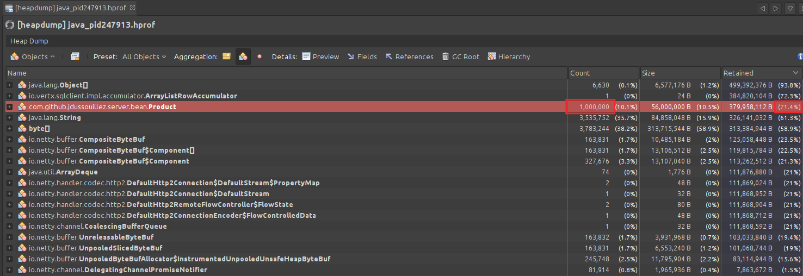
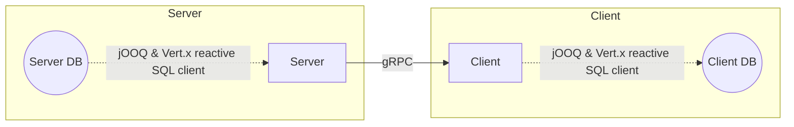

# quarkus-high-off-heap-mem-usage

Simple project to reproduce a suspicious behavior when trying to stream data from a database to a gRPC client.

Quarkus discussions:
- https://github.com/quarkusio/quarkus/discussions/37420

**Fix: streaming is not automatic, we have to explicitelly tell the statement to stream the result. Use branch [`streaming-fix`](https://github.com/jdussouillez/quarkus-db-grpc-streaming) for a working streaming server. [Fix commit](https://github.com/jdussouillez/quarkus-db-grpc-streaming/commit/dfa03d5e926c462ed5dc745f178dab7ed8d59884)**

**This branch is a test to check if R2DBC and Quarkus-jooq streams (our old implementation). It does stream.**

-----

The client opens a gRPC connection to the server to fetch some data (from a database). Then the client persists those data into its own database.

- [Reactive SQL client](https://quarkus.io/guides/reactive-sql-clients)
- [gRPC](https://quarkus.io/guides/grpc-getting-started)

*Based on https://github.com/jdussouillez/quarkus-high-off-heap-mem-usage*

## Expected behavior

The SQL client and gRPC both handle streaming. So the expected behavior is that data are streaming from the server database to the client database.

The client gets data from the server and persists them while the server is still reading data from its own database and sending them to the client.

The heap memory of the applications can be relatively small as data are streaming and not loaded all at once.

## Current behavior

It seems that all data (1 million "Product" rows in db) are loaded in heap memory on the server side and then sent to the client.
With 512 MB heap memory it ends with "OOM: Java heap space" because all data are loaded in the heap and takes 71.4% of the heap (365MB for a 512MB heap).

This should not happen because the data must be streaming. But the server reads all entities from the db all at once.

Servers logs:
```
Java.lang.OutOfMemoryError: Java heap space
Dumping heap to /tmp/java_pid247913.hprof ...

Exception: java.lang.OutOfMemoryError thrown from the UncaughtExceptionHandler in thread "vertx-blocked-thread-checker"
```

Heap dump generated on the server when the OOM error is triggered:



## Architecture

- `spec` - gRPC specifications (used by both the server and client)
- `server` - Server project
- `client` - Client project



Note:
- There are some duplicated code between server and client because this project is a throwaway.
- In this test project, both server and client databases are on the same PostgreSQL server (localhost:5432)

## Build

### 1. Start the database server

```sh
docker run -d \
    --rm \
    --name db \
    -p 5432:5432 \
    --network host \
    -e POSTGRES_USER=foo \
    -e POSTGRES_PASSWORD=bar \
    postgres:15-bullseye
```

Create the databases and insert data (in the server db only):

```sh
PGPASSWORD=bar \
    && psql -h localhost -p 5432 -U foo -f db/init.sql \
    && psql -h localhost -p 5432 -U foo -d client -f db/client-init.sql \
    && psql -h localhost -p 5432 -U foo -d server -f db/server-init.sql \
    && unzip db/server-data.sql.zip -d db/ \
    && psql -h localhost -p 5432 -U foo -d server -f db/server-data.sql -q -1 \
    && rm db/server-data.sql
```

**Optional**: To generate another set of data, use:

```sh
./db/generate-server-data.mjs \
    && PGPASSWORD=bar psql -h localhost -p 5432 -U foo -d server -f db/server-data.sql -q -1
```

### 2. Build the spec project

```sh
cd spec && ./mvnw clean install && cd ..
```

### 3. Build the server

```sh
cd server \
    && ./mvnw clean package \
    && cd ../client \
    && ./mvnw clean package \
    && cd ..
```

## Run

```sh
# Server
java -Xms512m -Xmx512m \
    -XX:+HeapDumpOnOutOfMemoryError -XX:HeapDumpPath=/tmp \
    -XX:StartFlightRecording=filename=/tmp/server.jfr \
    -jar server/server-rpc/target/quarkus-app/quarkus-run.jar
```

```sh
# Client
java -Xms512m -Xmx512m \
    -XX:+HeapDumpOnOutOfMemoryError -XX:HeapDumpPath=/tmp \
    -XX:StartFlightRecording=filename=/tmp/client.jfr \
    -jar client/target/quarkus-app/quarkus-run.jar

# Client, but fetch only 50k products - heap memory does not reach its max on the server side so everything works fine
java -Xms512m -Xmx512m \
    -XX:+HeapDumpOnOutOfMemoryError -XX:HeapDumpPath=/tmp \
    -XX:StartFlightRecording=filename=/tmp/client.jfr \
    -jar client/target/quarkus-app/quarkus-run.jar 50000
```

### With another client

We can also use `grpcurl` to reproduce the issue.

```sh
# Start server with dev mode to enable gRPC reflection service
$ cd server && ./mvnw -Djvm.args="-Xms512m -Xmx512m" -pl server-rpc -am quarkus:dev

# Send a request using grpcurl
$ docker run --rm --network host fullstorydev/grpcurl -plaintext -d '{}' localhost:1501 com.github.jdussouillez.api.grpc.ProductGrpcApiService/GetAll
```

## Cleanup

```sh
docker rm --force db \
    && docker rmi postgres:15-bullseye
```
